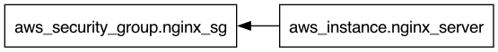

# Terraform Graph

The `terraform graph` command generates a visual representation of a Terraform configuration's dependency graph, showing relationships between resources, data sources, and other components. This helps understand how Terraform manages infrastructure.

Sample image:


### `terraform graph` Command
Running `terraform graph` outputs a dependency graph in **DOT format**, a graph description language used by **Graphviz**. The output includes nodes (resources, data sources, etc.) and edges (dependencies).

**Syntax**:
```bash
terraform graph [options]
```

- Run in a directory with Terraform configuration files (`.tf` or `.tf.json`).
- Produces machine-readable DOT format, which can be piped to Graphviz for visualization.

**Example Usage**:
```bash
terraform graph | dot -Tpng > graph.png
```
This:
1. Generates the DOT format dependency graph.
2. Pipes it to `dot`, a Graphviz tool.
3. Uses `-Tpng` to create a PNG image.
4. Saves the result as `graph.png`.

The `graph.png` shows nodes (resources, data sources, variables, providers) and edges (dependencies).

### `dot -Tpng`
The `dot` command, part of **Graphviz**, converts DOT format into a PNG image with `-Tpng`. This makes the textual graph human-readable.

- **Why use `dot -Tpng`?**
  - Raw DOT output is text-based and complex.
  - `-Tpng` creates a graphical image for easier analysis.
  - PNG is widely supported for sharing or viewing.

**Other Output Formats**:
Replace `-Tpng` with:
- `-Tsvg` for SVG.
- `-Tpdf` for PDF.
- `-Tjpg` for JPEG.

**Example with SVG**:
```bash
terraform graph | dot -Tsvg > graph.svg
```

### Installing Graphviz
To use `dot`, install **Graphviz**.

#### macOS (Using Homebrew)
Install with **Homebrew**:
```bash
brew install graphviz
```